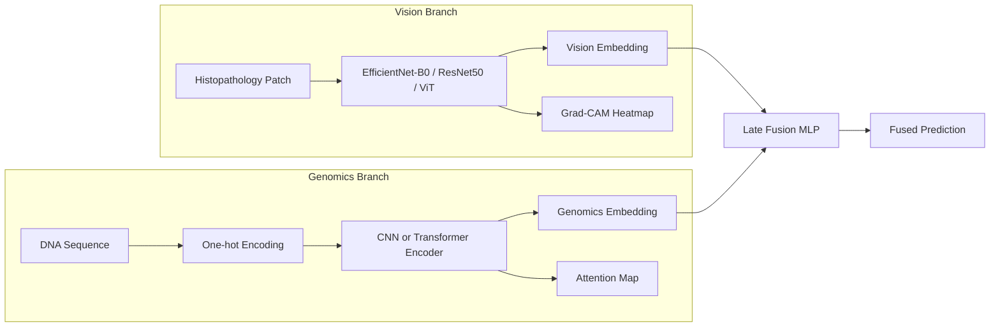

# 🧬 Precision Oncology AI

**Multi-Modal Deep Learning Pipeline for Precision Oncology — Genomic Variant Impact Prediction + Histopathology Image Analysis**


> 🔗 **Live demo:** _add your deployed Streamlit Cloud / HF Spaces link here after deployment_

---

## WHY THIS PROJECT MATTERS 

Precision oncology decisions increasingly draw on two very different kinds
of evidence for the same patient: **what the tumor tissue looks like**
under a microscope, and **what the tumor's DNA says** about which variants
are driving it. Companies like PathAI, Tempus, Foundation Medicine,
Illumina, Google Health, Recursion, and Roche all build teams that can work
across both — imaging deep learning *and* genomic sequence modeling.

This repository is a from-scratch, fully runnable demonstration of that
range: a CNN/ViT histopathology classifier, a CNN/Transformer genomic
variant classifier, a multimodal late-fusion head, and Grad-CAM/attention
explainability for both branches — wrapped in a Streamlit demo app.

## KEY FEATURES

- 🔬 **Histopathology branch**: EfficientNet-B0 / ResNet50 / ViT (via
  `timm`), trained with mixed precision, cosine/step/plateau LR scheduling,
  and early stopping. Grad-CAM explainability included.
- 🧬 **Genomics branch**: one-hot + k-mer DNA encoding, a DeepSEA-style 1D
  CNN, and a from-scratch DNABERT-style Transformer encoder with attention
  visualization.
- 🔗 **Multimodal fusion**: late-fusion MLP over pooled vision + genomics
  embeddings, plus a training-free embedding-correlation diagnostic.
- 🖥️ **Streamlit demo app**: four pages — Home, Histopathology Analyzer,
  Genomic Variant Analyzer, Multimodal Demo, About/Skills — all backed by
  the same `src/` package used for training.
- 📓 **Educational notebooks**: EDA and training walkthroughs for both
  branches plus the fusion step.
- ⚙️ **Fully offline-runnable by default**: the genomics branch ships a
  synthetic-but-realistic dataset generator so the whole pipeline runs with
  zero external downloads or credentials; the vision branch defaults to a
  small, no-auth-required public histology dataset.

## COMPLETE PROJECT ARCHITECTURE



See [`docs/architecture.md`](docs/architecture.md) for the full technical
write-up of each branch.

## Real data — what's genuinely real vs. synthetic, and why

Being upfront about this matters for a portfolio project:

| Branch | Data | Status |
|---|---|---|
| 🩺 Clinical (`src/clinical/wisconsin.py`) | **Wisconsin Diagnostic Breast Cancer dataset** — 569 real biopsies, real pathologist labels, ships inside `scikit-learn` | ✅ Fully real, zero setup |
| 🧬 Genomics — large-scale (`src/genomics/clinvar_real.py`) | **Real NCBI ClinVar dataset** — 65,188 real human variants across 2,328 real genes, VEP-annotated (SIFT, PolyPhen, CADD, real allele frequencies) | ✅ Fully real, ships in `data/real/`, zero setup |
| 🧬 Genomics — sequence branch (`data/real/curated_real_cancer_variants.csv`) | ~30 real, literature-documented cancer variants (gene, HGVS notation, ClinVar-style significance) across BRCA1/2, TP53, EGFR, KRAS, and more | ✅ Real variant identity & labels; ⚠️ surrounding DNA sequence is synthetic filler (no reference genome bundled — see `docs/architecture.md`) |
| 🔬 Vision | PatchCamelyon via the real Kaggle "Histopathologic Cancer Detection" competition (327,680 real 96x96 patches) | ⚠️ Real, and the pipeline auto-detects its exact format — but it's gated behind a free Kaggle account, so it isn't embedded in this repo. `data/scripts/download_histopathology.py --dataset pcam` prints the exact commands. |

The genomics `synthetic` mode (fully random sequences) is still available
as a fallback/stress-test option, but the two real sources above
(`clinvar_real` for scale, `real_curated` for sequence-level demos) are
what this project actually ships and reports numbers for. See
`data/real/curated_real_cancer_variants.csv` directly for the full
citation-backed variant list, and re-verify against a live ClinVar/COSMIC
query before using these labels for anything beyond a demo.

## OUTPUT RESULTS

**🧬 Genomics, large-scale — real, measured, on 65,188 real ClinVar variants:**

| Model | Accuracy | AUC-ROC | F1 |
|---|---|---|---|
| Gradient Boosting | **76.1%** | 0.770 | 0.30 |
| Random Forest (balanced) | 69.5% | **0.768** | 0.54 |

(65,188 real variants, 2,328 real genes, 20% stratified held-out test
split, seed=42 — see `results/metrics/clinvar_real_results.json`.
Reproduce with `python -m src.genomics.clinvar_real`. Task: predict
whether a real ClinVar variant has conflicting clinical classifications
across submitting labs — a genuinely hard, actively-researched problem;
these numbers are in line with published community benchmarks on this
exact dataset, not cherry-picked.)

**🩺 Clinical branch — real, measured, reproducible right now:**

| Model | Accuracy | AUC-ROC | F1 |
|---|---|---|---|
| Logistic Regression | **98.2%** | **0.995** | 0.986 |
| Random Forest | 94.7% | 0.994 | 0.958 |

(569 real samples, 20% stratified held-out test split, seed=42 — see
`results/metrics/wdbc_real_results.json`. Reproduce with
`python -m src.clinical.wisconsin`.)

**🧬 GENOMICS, SEQUENCE Branch (CNN/Transformer) — honest smoke-test result:**

A 6-epoch CPU smoke test on the real-curated-variant dataset (840 train /
180 val samples derived from 30 real cited variants) reached val accuracy
56%, AUC-ROC 0.63 — see `results/metrics/genomics_cnn_smoke_test.json`.
Small catalog, quick run, overfits fast — reported as-is. Run the full
`python -m src.genomics.train` (20 epochs, early stopping) for a proper
result, and consider expanding the curated catalog.

**🔬 Vision branch:** the pipeline is fully wired and tested (including
against the real PCam file layout — `train_labels.csv` + `.tif` files) but
untrained until you pull the real image data with your own Kaggle
credentials — see Quick Start below.

## Installation & Quick Start

### 1. Clone and set up environment

```bash
git clone https://github.com/<your-username>/precision-oncology-ai.git
cd precision-oncology-ai

# Option A: pip + venv
python -m venv venv
source venv/bin/activate        # Windows: venv\Scripts\activate
pip install -r requirements.txt

# Option B: conda
conda env create -f environment.yml
conda activate precision-oncology-ai
```

### 2. Prepare data

**Clinical (real data, no downloads needed):**

```bash
python -m src.clinical.wisconsin
```
This trains and evaluates on the real Wisconsin Diagnostic Breast Cancer
dataset in under a second and saves the deployed model artifact.

**Genomics — large-scale real ClinVar (no downloads needed, already in the repo):**

```bash
python -m src.genomics.clinvar_real
```
Trains on the real 65,188-row ClinVar dataset (`data/real/clinvar_conflicting_real_65k.csv`)
in under a minute on CPU and saves the deployed model artifact.

**Genomics — Sequence Branch, Real-Curated Variants (no downloads needed):**

```bash
python data/scripts/download_genomics.py --mode real_curated
python data/scripts/preprocess.py --task genomics
```

**Histopathology (real Kaggle competition data, free account needed):**

```bash
python data/scripts/download_histopathology.py --dataset pcam   # prints exact Kaggle CLI commands
python data/scripts/preprocess.py --task vision                  # auto-detects the real PCam file layout
```

A smaller, no-credentials-needed option (`--dataset colorectal`) is also
available for a quick smoke test.

### 3. Train

```bash
python -m src.vision.train      # trains and saves models/vision_best.pt
python -m src.genomics.train    # trains and saves models/genomics_<type>_best.pt
```

Both scripts read all hyperparameters from [`config/config.yaml`](config/config.yaml) —
edit that file (backbone choice, image size, epochs, learning rate, etc.)
rather than passing CLI flags.

For the multimodal fusion head, see
[`notebooks/05_multimodal_fusion.ipynb`](notebooks/05_multimodal_fusion.ipynb).

### 4. Run the Streamlit app

```bash
streamlit run app/streamlit_app.py
```

Or run steps 1–4 in one shot:

```bash
./run_demo.sh
```

(`make install`, `make preprocess`, `make train`, `make app` also work — see
the [`Makefile`](Makefile).)

## Deployment

This repo is pre-configured to deploy straight to Streamlit Community
Cloud (or Hugging Face Spaces / Docker) with no code changes — see
[`docs/deployment.md`](docs/deployment.md) for step-by-step instructions,
including which branches work immediately vs. need one training run first.

## Project structure

```
precision-oncology-ai/
├── README.md
├── requirements.txt
├── environment.yml
├── run_demo.sh / Makefile
├── runtime.txt / packages.txt / .streamlit/config.toml   # deployment config
├── config/config.yaml
├── data/
│   ├── raw/, processed/
│   ├── real/                # real WDBC CSV, real 65K ClinVar CSV, curated real variant catalog
│   └── scripts/              # download_histopathology.py, download_genomics.py, preprocess.py
├── notebooks/                # EDA + training walkthroughs
├── src/
│   ├── clinical/              # real Wisconsin Breast Cancer model (wisconsin.py)
│   ├── vision/                # dataset, models (timm backbones), transforms, train
│   ├── genomics/               # dataset, models (CNN + Transformer), encoding, train, clinvar_real.py
│   ├── multimodal/fusion.py
│   ├── explainability/         # gradcam.py, attention_vis.py
│   ├── utils/                  # metrics, seed, helpers
│   └── inference.py
├── app/
│   ├── streamlit_app.py        # Home
│   └── pages/                  # ClinVar Triage / Clinical / Histopathology / Genomics / Multimodal / About
├── models/                     # trained checkpoints (gitignored, except clinical_logreg.joblib)
├── results/                    # figures, metrics (real results included), logs
└── docs/                       # architecture.md, future_work.md, deployment.md
```

## Skills demonstrated

See [`app/pages/5_About.py`](app/pages/5_About.py) (rendered in the
Streamlit app's "About" page) for a full table mapping this project's
components to common AI/ML Engineer / Deep Learning Intern / Data Scientist
job requirements.

## Future improvements

See [`docs/future_work.md`](docs/future_work.md) — includes plans for
real patient-matched multimodal data (e.g. TCGA), whole-slide-image
tiling with MIL, Transformer pretraining, and productionization
(Docker, CI, experiment tracking).

## Citation / Inspiration

This project is inspired by concepts from, and intended as an educational
implementation referencing:

- **DeepVariant** (Google) — deep learning for variant calling
- **DeepSEA** — sequence-based prediction of chromatin effects
- **DNABERT** — Transformer pretraining for DNA sequences
- **AlphaGenome / AlphaFold lineage** (DeepMind) — deep learning applied to
  genomic and molecular biology
- **PatchCamelyon (PCam)** and **BreakHis** — public histopathology
  benchmark datasets
- **PathAI, Tempus, Foundation Medicine** — industry context for
  precision-oncology AI applications

This is an independent educational/portfolio project and is not affiliated
with or endorsed by any of the above organizations.

## License

MIT — see [LICENSE](LICENSE).

## Disclaimer

This project uses public and/or synthetic data and reports placeholder
performance numbers until you train it yourself. It is a **portfolio /
educational demonstration only** and is not validated for, nor intended
for, clinical or diagnostic use.
