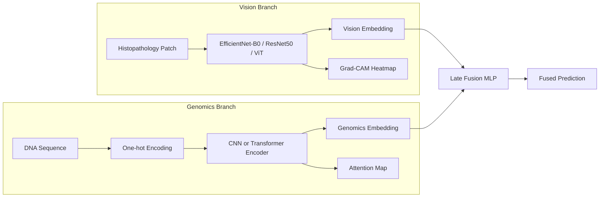

# Architecture

## Overview

## Vision branch

- **Input**: RGB histopathology patches (default 96×96, configurable).
- **Backbone**: any `timm` model — default `efficientnet_b0`, with `resnet50`
  and `vit_small_patch16_224` as drop-in alternatives via `config.yaml`.
- **Head**: global-pooled backbone features → dropout → linear classifier.
- **Training**: mixed precision (`torch.cuda.amp`), cosine/step/plateau LR
  scheduling, early stopping on validation loss.
- **Explainability**: Grad-CAM on the backbone's last convolutional layer
  (`src/explainability/gradcam.py`). Note: Grad-CAM as implemented targets
  CNN backbones; ViT backbones would need an attention-rollout style
  explainer instead.

## Genomics branch

- **Input**: raw DNA sequence, one-hot encoded to `(L, 4)` (`A, C, G, T`).
- **Models**:
  - `DeepSEAStyleCNN` — a compact 1D-CNN inspired by DeepSEA/DeepVariant
    sequence encoders (three conv blocks + global average pooling).
  - `DNATransformerEncoder` — a small Transformer encoder (DNABERT-style)
    operating directly on one-hot inputs with a learned `[CLS]` token,
    trained from scratch (no external pretraining) to keep this runnable
    without large downloads.
- **Explainability**: for the Transformer, a dedicated single-head attention
  probe (`get_attention`) returns the `[CLS]` token's attention over
  sequence positions, visualized as a heatmap strip
  (`src/explainability/attention_vis.py`).

## Multimodal fusion

- **Late fusion (`LateFusionClassifier`)**: concatenates the pooled vision
  embedding and pooled genomics embedding, then a small MLP predicts a
  fused label. This assumes paired vision/genomics samples for the same
  patient — for this from-scratch portfolio project, pairing is simulated
  since PCam/BreakHis and ClinVar are not natively linked at the
  patient level (see `notebooks/05_multimodal_fusion.ipynb` for how the
  demo constructs a paired toy dataset).
- **Correlation analysis (`embedding_correlation`)**: a lighter-weight,
  training-free diagnostic that checks how correlated the two branches'
  embeddings are, useful for a notebook exploration cell.

## Data flow

1. `data/scripts/download_*.py` — fetch raw data into `data/raw/`.
2. `data/scripts/preprocess.py` — builds stratified train/val/test CSV
   splits into `data/processed/`.
3. `src/vision/train.py`, `src/genomics/train.py` — train each branch,
   saving best checkpoints to `models/`.
4. `notebooks/05_multimodal_fusion.ipynb` — trains the fusion head.
5. `app/streamlit_app.py` — loads checkpoints from `models/` for live
   inference and explainability.

## Extending to real ClinVar sequence data

`data/scripts/download_genomics.py --mode clinvar` downloads NCBI's ClinVar
`variant_summary.txt.gz`, which lists variant genomic coordinates and
clinical significance but **not** flanking sequence context. To turn this
into trainable sequences:

1. Download a reference genome FASTA (e.g. GRCh38) — not included here due
   to size (~3 GB).
2. Use `pyfaidx` (or `samtools faidx`) to extract a window of `seq_length`
   bases centered on each variant's coordinate.
3. Feed the resulting `(sequence, clinical_significance)` pairs through the
   same `preprocess.py --task genomics` pipeline.

This is left as a documented extension rather than shipped by default, so
the project runs fully offline out of the box via the synthetic dataset.
